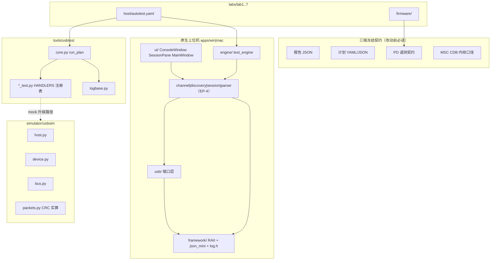
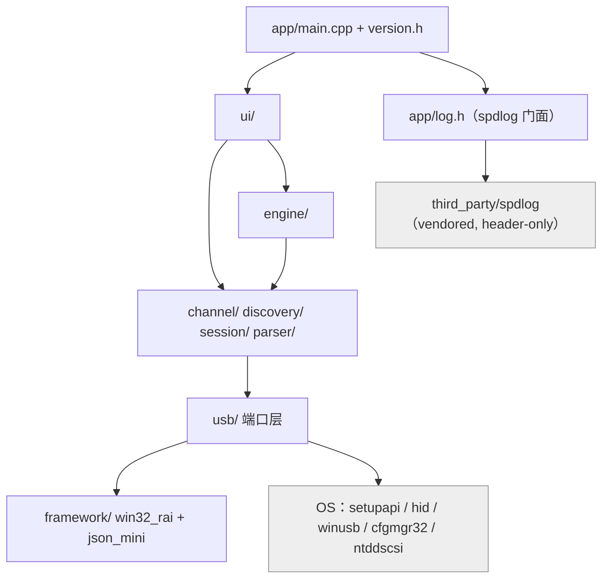
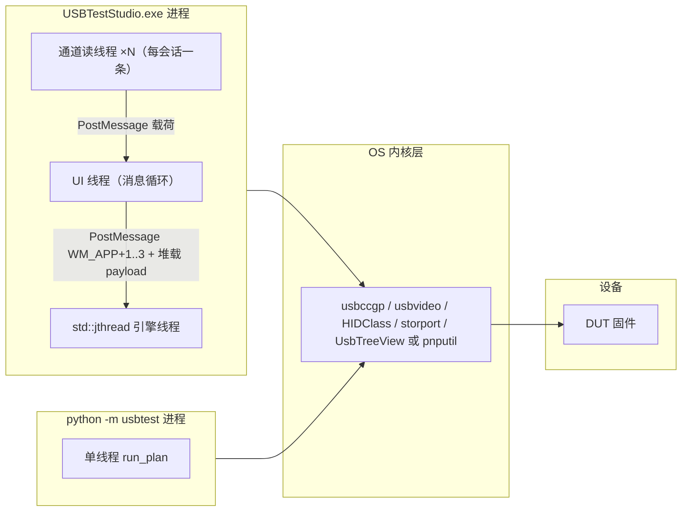
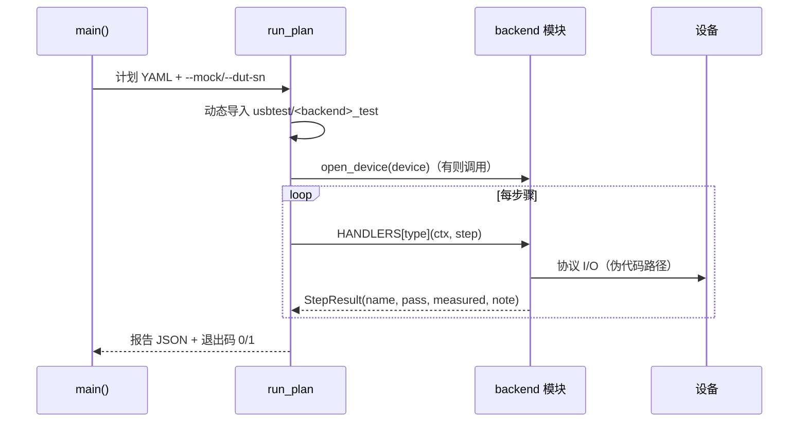
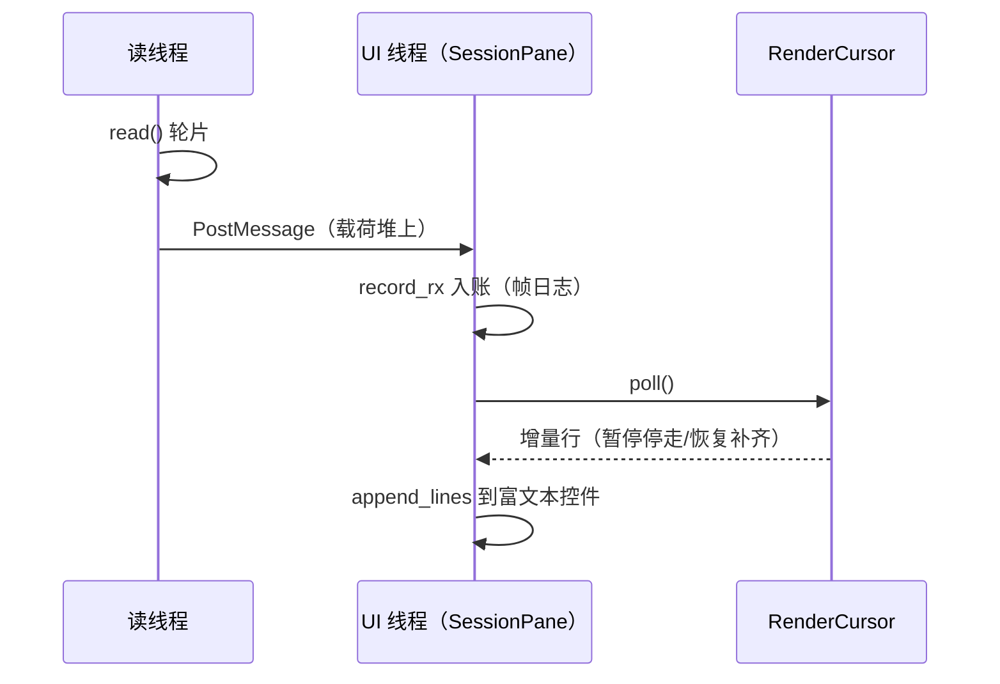
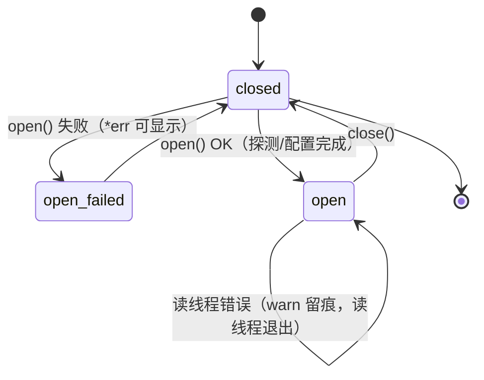
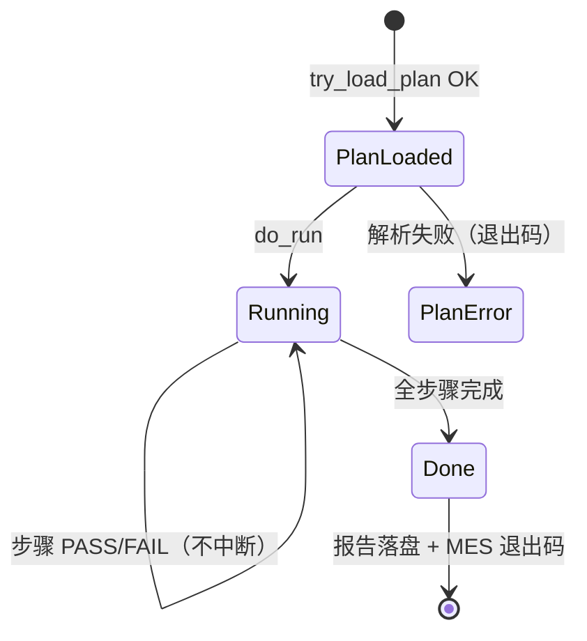

# 架构 · usb-labs 体系（产测三端 + 协议仿真 + 原生上位机）

## 1. Overview

本文档覆盖 usb-labs 仓库的运行期结构：7 个实验室固件、Python 产测框架（usbtest）、协议仿真器（usbsim）、双平台原生上位机（USBTestStudio）。核心设计目标只有一个——**同一套产测契约在 Python / Win32 / macOS 三端字段级同构**，使测试计划可互换、报告可直接进 MES。

## 2. Architecture Context

```mermaid
flowchart LR
    op["产线工人 / 工程师"] --> app["USBTestStudio (Win/mac)"]
    ci["GitHub Actions"] --> usbtest["usbtest (Python)"]
    mes["MES 系统"] -- "退出码 0/1 + 报告 JSON" --> app
    app -- "SetupDi / HidD / WinUSB / SCSI 直通 / 串口" --> os["Windows USB 栈"]
    usbtest -- "hidapi / pyusb / sounddevice" --> os
    os --> dut["DUT / 工装（HID/CDC/MSC/UVC/UAC/PD/BLE/Dock）"]
    dut -. "固件" .-> fw["labs/lab1..7 固件 (pico/STM32/NCS)"]
    app -- "串口 key=value 行" <-.-> pd["Lab5 PD 遥测"]
    usbtree["USBTree 知识库（独立仓库）"] -. "概念引用链接" .-> app
```

与外部世界的两条硬边界：**OS USB 栈**（所有设备访问的必经之路，Windows 上 UVC/复合设备被系统驱动持有是常态而非异常）与 **MES**（只认报告 JSON 与进程退出码）。USBTree 是文档级单向引用，无运行期依赖。

## 3. Logical Architecture



契约层是唯一跨 subgraph 的强耦合点；其余依赖全部自上而下单向。usbsim 目前只与 usbtest 的 MSC 链路端到端接通（`test_msc.py` 的 UsbSimBotDev），其余后端 mock 仍为确定性占位 `(推断：其余后端接入路径在 README 中为规划，未见实现)`。

## 4. Component Responsibilities

| Component | 负责 | 不负责 |
|---|---|---|
| `core.py`（run_plan） | 计划解析、按 backend 动态导入、步骤循环、报告生成、退出码 | 协议语义、设备打开细节 |
| `*_test.py`（HANDLERS） | 单个步骤类型的协议语义与判定（如 msc_read_verify） | 计划流转、其他后端的设备 |
| `mock_test.py` | 无硬件确定性通过（CI 用） | 任何真实 I/O |
| `usbsim/` | 虚拟总线上的真协议行为（CRC/状态机/错误注入） | 真硬件时序（如具体 µs 级 chirp） |
| `usb/` 端口层（Win） | Win32 API 封装：重叠 I/O、超时、SENSE 解析 | EP-4 会话语义、解析规则 |
| `channel/`（IChannel 四通道） | 统一会话抽象、统计、回调线程模型 | 设备发现、UI 渲染 |
| `discovery/` | 设备目录、即时过滤、会话工厂 | 通道数据收发 |
| `session/` | 编解码、历史/帧日志、渲染游标 | 打开设备、解析协议语义 |
| `parser/` | 报告解码（HID/PD 遥测）与选型 | 通道生命周期 |
| `engine/`（Win test_engine） | 计划执行线程、步骤分发、报告落盘 | UI 更新（只 PostMessage） |
| `ui/` | 窗口、控件、账面渲染 | 阻塞 I/O（UI 线程零阻塞 I/O） |
| `firmware/`（labs） | DUT 侧协议行为、遥测输出 | 主机侧任何逻辑 |

## 5. Dependency Architecture（Windows 应用内部）



依赖单向：`app → ui → engine/EP-4 → usb → framework`。模板化假件（`PortT`）使 EP-4 与 usb 内核可离线自测——**模板参数即注入缝**，不引抽象基类运行期开销。

## 6. Runtime Architecture



线程模型要点：UI 线程零阻塞 I/O；引擎在独立 `std::jthread`；每条打开的通道一个读线程，接收经 `PostMessage` 投递 UI 线程入账（`session_view::RenderCursor` 增量渲染）。Python 侧刻意单线程——产测步骤顺序执行，报告串行落盘。

## 7. Key Sequence

### 7.1 产测步骤派发（usbtest，三端同构的参考实现）



步骤级失败不中断整站；`--mock` 整体换用 `mock_test.py`，让 CI 在无硬件环境验证计划语法与报告链路。

### 7.2 会话台接收链路（EP-4，Win）



## 8. Interface / Contract

| Interface | Direction | Transport | Payload | Sync/Async | Error |
|---|---|---|---|---|---|
| `HANDLERS[type](ctx, step)` | run_plan → 后端 | 进程内函数 | 计划步骤 dict + ctx（dev/参数） | Sync | 返回 `passed=False`，不抛（异常被逐步骤 except 捕获记 FAIL） |
| `StepResult` | 后端 → run_plan | 进程内 | name/pass/measured/note | Sync | — |
| 报告 JSON | 工具 → MES | 文件 + 退出码 | `{plan, station, dut_sn, verdict, started, steps[{name,pass,measured,note}]}`（三端字段级一致） | Async | 退出码 0/1 |
| 计划 YAML/JSON | 人/CI → 工具 | 文件 | `device{backend,vid,pid}` + `steps[{type,...}]`（YAML 与 JSON 同名同义可互换） | — | 加载失败即 PlanError 退出 |
| `IChannel` | EP-4 层间 | 进程内虚表 | open/close、send(bytes)、set_receive_callback、set_read_timeout、desc/stats | send 同步有界（kSendTimeoutMs=3000）；接收经回调线程 | `*err` 出参给可显示原因 |
| PD 遥测 | Lab5 固件 → 采集方 | 串口文本行 | `cc_state/contract_v/contract_i/vbus_v` 各一行 | 周期 500ms + 状态沿 | 只加字段不改名 |
| 日志门面 | 各模块 → sink | 进程内 | `[时间][级别][模块][线程] 消息`（C++ spdlog / Python logbase / Swift UTSLog 同格式） | Async sink | `USBTS_LOG_LEVEL` 开关，warn+ 即刷盘 |
| usbtest CLI | CI/MES → Python | 命令行 | `--plan --mock --dut-sn --station --report-dir` | — | 退出码供 MES |

**三端冻结契约**：报告 JSON 字段、计划字段名、PD 遥测键、MSC CDB 口径（>2TB RC10 哨兵→RC16、READ/WRITE(16) 高 LBA 选路、31 字节 CBW）——任何一侧改动必须同步其余侧并各自补自测钉。

## 9. State / Lifecycle

### 9.1 通道会话（IChannel，四通道同状态集）



### 9.2 产测 run 生命周期



## 10. Non-Functional Requirements

| Category | Requirement |
|---|---|
| Latency | UI 线程零阻塞 I/O（超时上界：send 3s / MSC 探测 3s / 数据面 READ10 20s） |
| Threading | UI 1 + 引擎 jthread 1 + 每会话读线程 1 |
| Determinism | mock 模式 CI 全绿与硬件无关；usbsim CRC 实算可复现 |
| Reliability | 滚动文件日志 5MB×3；warn 级即刷盘（崩溃前现场可回放） |
| Compatibility | Windows 10/11 x64（VS2022 v143/MSVC 14.51）；macOS Swift 5.9 口径（未编译验证） |
| 离线可测 | C++ 四自测 483 例无硬件全绿；Python 35+39+8 例同 |
| MES 集成 | 进程退出码 0/1 + 报告 JSON 字段级稳定 |

## 11. Key Decisions (ADR)

| ID | Decision | Status | Alternatives | Reason | Impact |
|---|---|---|---|---|---|
| ADR-001 | spdlog vendored（header-only，`SPDLOG_WCHAR_FILENAMES`） | Accepted | 自研日志 / vcpkg | 三要求（核心模块/spdlog/规范）+ 中文 LOCALAPPDATA 路径安全 + CI 可编 | third_party 1.2MB 入库；升级走 tag 覆盖 |
| ADR-002 | 端口层模板注入（`PortT` 假件）自测内核 | Accepted | 运行期抽象基类 + mock 对象 | 离线自测钉真实现路径；零虚表开销 | 模板实例化编译时长↑；假件与真件签名需同步 |
| ADR-003 | usbtest 后端 importlib 动态派发 | Accepted | 注册表静态 import | 建文件即挂后端；CI 口径简单 | 缺导入错误被步骤 except 吞 → 已补 test_backends 导入钉 |
| ADR-004 | 三端报告 JSON 字段级同构 | Accepted | 各端自定义格式 | MES 单集成点；计划可互换 | 改字段必须三端同步（冻结契约） |
| ADR-005 | MSC 本版只读（write_verify 仅 Python 侧 + 破坏性红线） | Accepted | 全功能读写 | 产线安全：误写产线盘不可接受 | 写校验仅限空白盘/授权介质 |
| ADR-006 | Windows dock 拓扑 UsbTreeView 优先 → pnputil 回退 | Accepted | 仅 lsusb（Linux） | Windows 无内置 lsusb；pnputil Win10 2004+ 内置零安装 | zh-CN GBK 输出需双编码解码（已修） |
| ADR-007 | 引擎→UI 用 PostMessage + 堆载 payload | Accepted | 互斥锁共享队列 | Win32 原生、UI 线程无锁 | payload 生命周期归 UI 侧 delete |
| ADR-008 | UVC open 对 `set_configuration` 失败容错 | Accepted | 硬失败 | Windows 系统 UVC 驱动持有设备是常态，描述符树仍可读、采帧走 cv2 | 信息性告警而非失败（真机实证） |

## 12. Risks / Open Issues

| ID | Issue / Risk | Impact | Status | Owner |
|---|---|---|---|---|
| R-001 | macOS 端（Log.swift/发现过滤）未编译验证 | Medium（需 macOS 一次编译过） | Open | 需 macOS 环境 |
| R-002 | T5/T8/T14 真机验收与实验室 bring-up 未执行（缺 U 盘/串口治具/蓝牙适配器/USB 声卡/dock） | High（协议真机口径未闭环） | Open | 需硬件采购 |
| R-003 | usbsim 其余后端（非 MSC）mock 仍为确定性占位 | Medium（仿真器覆盖不全） | Open | 后续切片 |
| R-004 | UsbTreeView CLI 参数以官方文档为准，未经真实安装核对 | Low（有 pnputil 回退兜底） | Open | 装 UsbTreeView 后核对 |
| R-005 | HID 回报率静置 0Hz / 输出报告 -1 为 DUT 特异行为，产线口径需固件自测模式配合 | Medium（T8 工装域） | Open | Lab1 固件自环 TODO |

## 待确认项

- [ ] usbsim 非 MSC 后端的 mock 升级路径与接入顺序（README 为规划性描述，未见排期）
- [ ] UsbTreeView `/c /f` 参数形状（代码按已知口径钉死，未实际安装核对）
- [ ] macOS 端 `DeviceScanner.filtered` 在真机上的 IOKit 枚举行为（本切片未编译）
- [ ] Lab1 固件自环测试模式（hid_report_loopback 工装路径的固件侧 TODO）
