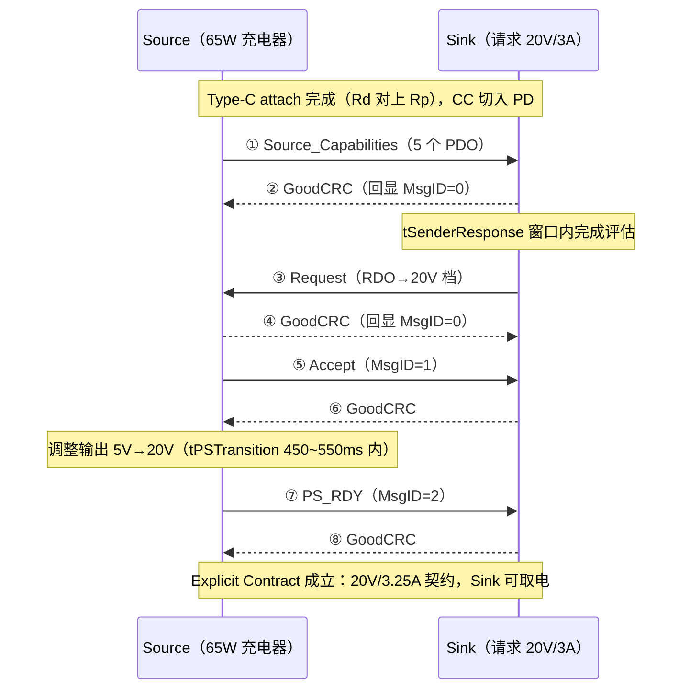

# PD 协商帧序列解析：Source_Capabilities → Request → Accept → PS_RDY

> 📍 [lab5-pd-charger/capture/](./)
>
> ⚠️ **诚实声明**：本文所有帧内容为**基于 USB PD 3.x 规范重构的教学示例**，不是真实抓包。构造参数（65 W 充电器的 PDO 组合、RDO 数值）是工程上典型但虚构的取值。真实抓包请用协议分析仪自行采集；本仓库根目录 `captures/` 为真实抓包预留存放位，**未经真实采集前不填充数据**。
> 字段定义出处：知识库 [04-USBPD协议](https://github.com/tangjianfang/USBTree/blob/main/30-枝干-接口与供电/04-USBPD协议.md)、[07-USBPD深入-状态机与消息全表](https://github.com/tangjianfang/USBTree/blob/main/30-枝干-接口与供电/07-USBPD深入-状态机与消息全表.md)、[08-USBPD消息全表](https://github.com/tangjianfang/USBTree/blob/main/30-枝干-接口与供电/08-USBPD消息全表.md)。

## 1. 场景设定

| 项 | 取值 |
| --- | --- |
| Source | 65 W GaN 充电器，PD 3.0 |
| Sink | 桌面设备，请求 20 V/3 A |
| 协商版本 | 双方取共同版本 PD 3.0（Header Rev=10） |
| Source 广播的 5 个 PDO | 5 V/3 A、9 V/3 A、15 V/3 A、20 V/3.25 A、PPS 3.3~11 V/3 A |

## 2. 帧在 CC 线上的样子（BMC 物理层）

PD 报文跑在与连接方向一致的那**一根 CC 线**上（半双工，同一时刻只有一个发送方）：

```
| Preamble(64bit 0101交替) | SOP(K码×4) | Header(16bit) | 数据对象(0~7×32bit) | CRC-32 | EOP |
```

| 元素 | 说明 |
| --- | --- |
| Preamble | 64 位 0101 交替序列，供接收方恢复时钟（不参与 4b5b） |
| SOP | 4 个 K 码"收件人"：SOP=对端端口，SOP'/SOP''=线缆芯片（E-marker） |
| 线路编码 | 4b5b + **BMC（双相标记编码）**，约 300 kbps，LSB 先发 |
| 校验 | CRC-32（多项式 0x04C11DB7 族） |
| 结束 | EOP 单 K 码，发送方随即释放 CC |
| 可靠性 | 每帧必被对方 **GoodCRC** 确认（回显 MessageID）；发送方超时（tReceive 0.9~1.1 ms）未收到即重发，重发沿用同一 MessageID |

在示波器上，CC 直流工作点（Rp/Rd 分压）之上叠加 BMC 交流分量，肉眼看到的是"波形变密的一段"。幅值与直流偏置的数值以规范 PHY 章节为准。

## 3. 消息序列总览（重构）



①③⑤⑦ 为主消息，②④⑥⑧ 为每帧自动跟随的 GoodCRC（通常由协议芯片硬件完成）。

## 4. 逐消息 Header 与对象解读

### ① Source_Capabilities（Source → Sink，MsgID=0）

**Header = 0x51A1**

| 位段 | 值 | 字段 | 解读 |
| --- | --- | --- | --- |
| 15 | 0 | Extended | 普通消息 |
| 14:12 | 5 | Number of Data Objects | 后跟 5 个 PDO |
| 11:9 | 0 | MessageID | 本方向第 0 帧（0~7 循环） |
| 8 | 1 | Port Power Role | 1=Source |
| 7:6 | 10 | Spec Revision | PD 3.0 |
| 5 | 1 | Port Data Role | 1=DFP（Source 默认） |
| 4:0 | 0x01 | Message Type | 1=Source_Capabilities（数据消息） |

**5 个 PDO（32 bit each，低位在前发送）**：

| # | 十六进制 | 类型 | 解码 |
| --- | --- | --- | --- |
| 1 | 0x0001912C | Fixed | 电压 B19:10=0x064=100 → 100×50mV=**5.00V**；电流 B9:0=0x12C=300 → **3.0A**（首对象必为 vSafe5V） |
| 2 | 0x0002D12C | Fixed | B19:10=0x0B4=180 → **9.00V** / **3.0A** |
| 3 | 0x0004B12C | Fixed | B19:10=0x12C=300 → **15.00V** / **3.0A** |
| 4 | 0x00064145 | Fixed | B19:10=0x190=400 → **20.00V**；B9:0=0x145=325 → **3.25A**（65W 档） |
| 5 | 0xC8DC213C | APDO-PPS | B31:30=11、B29:28=00（PPS）、B27=1（Power Limited）；Max V B24:17=110 → **11.0V**；Min V B15:8=33 → **3.3V**；Max I B6:0=60 → **3.0A**（位域见知识库 08 文第七节） |

### ③ Request（Sink → Source，MsgID=0）

**Header = 0x1082**

| 位段 | 值 | 字段 | 解读 |
| --- | --- | --- | --- |
| 14:12 | 1 | Objects | 1 个对象 = RDO |
| 11:9 | 0 | MessageID | Sink 方向第 0 帧 |
| 8 | 0 | Power Role | 0=Sink |
| 7:6 | 10 | Spec Revision | PD 3.0 |
| 5 | 0 | Data Role | 0=UFP（Sink 默认） |
| 4:0 | 0x02 | Message Type | 2=Request |

**RDO = 0x4104B145**（指向 20 V 档）

| 位段 | 值 | 字段 | 解读 |
| --- | --- | --- | --- |
| 31:28 | 4 | Object Position | 请求第 4 个 PDO（20V 档），1 起计数 |
| 27 | 0 | GiveBack | 不支持退让到最小电流 |
| 26 | 0 | Capability Mismatch | 有完全满足需求的档（=1 则是"能用但不满速"诊断线索） |
| 25 | 0 | USB Comm Capable | 本设备不走 USB 数据 |
| 24 | 1 | No USB Suspend | 不接受挂起降功率 |
| 23:20 | 0 | 预留 | — |
| 19:10 | 0x12C=300 | 操作电流 | 300×10mA = **3.00A**（实际需要的电流） |
| 9:0 | 0x145=325 | 最大电流 | 325×10mA = **3.25A**（不超 PDO 上限） |

> 注意 RDO 里**没有电压字段**——电压由 ObjPos 指向的 PDO 决定；请求 PPS 时改用 PPS RDO 变体（电压 20 mV 步进，见知识库 08 文）。

### ⑤ Accept（Source → Sink，MsgID=1）

**Header = 0x03A3**：控制消息（Objects=0），MsgID=1（0x0200），Source 角色（0x0100）、Rev3（0x0080）、DFP（0x0020）、Type=3。

### ⑦ PS_RDY（Source → Sink，MsgID=2）

**Header = 0x05A6**：控制消息，同上构造（MsgID=2 → 0x0400），Type=6。**收到它才算契约生效**——之前 VBUS 仍在 5 V，Sink 不得假设电压已切换（这是新手烧后级 DC-DC 的第一名原因）。

### GoodCRC（②④⑥⑧）

每条主消息后紧接，由接收方发出（通常协议芯片硬件自动）：
- ② Sink 回：Header = 0x0081（控制 Type=1，MsgID=0 回显，Sink/UFP 角色）
- ④ Source 回：Header = 0x00A1（MsgID=0 回显，Source/DFP 角色）

## 5. 协商之后的边支（重构要点）

| 事件 | 消息流 | 说明 |
| --- | --- | --- |
| Sink 改主意（要 9V） | 再次 Request → Accept → PS_RDY | 新契约覆盖旧契约 |
| Source 能力变化 | 主动重播 Source_Capabilities | 触发 Sink 重评估 |
| Sink 主动索要 | Get_Source_Cap → Source_Capabilities | 控制消息 0x07 |
| PPS 保活 | Sink 周期性重发 Request（指向 PPS APDO） | 超时未续 → 回落固定档 |
| 协议僵死 | Soft_Reset（只复位协议层，契约保留）→ 不行则 **Hard Reset**（VBUS 掉 vSafe0V 再回 5V，契约作废） | 兜底通道 |
| EPR 进入 | 前置 SOP' 查线缆 EPR capable + 契约 ≥100W → EPR_Mode 握手 → EPR_Request | 不会出现在普通 Source_Cap 里 |

## 6. 真实抓包会与本文有什么不同

本文是"干净的最短路径"重构。真实采集中你几乎必然还会看到：

- **Source_Capabilities 周期重播**（未收到 Request 时，tTypeCSendSourceCap 间隔、nCapsCount 上限 50）；
- **MsgID 0→7 循环**，重传时同一 MsgID 出现两次（GoodCRC 丢失）；
- Sink 的 **Sink_Capabilities**（被 Get_Sink_Cap 触发时）、各厂商 **VDM 私有消息**、PD 3.0+ 的 **Not_Supported** 应答；
- Hard Reset 前导（RST K 码序列）与 VBUS 掉电窗；
- 时间轴上的抖动：GoodCRC 应答在几百 µs 量级完成，Request 评估耗时随 Sink 实现而变。

## 7. 真实测量指引

| 工具 | 怎么用 | 适用 |
| --- | --- | --- |
| 商用 PD 协议分析仪（GRL、Ellisys、Total Phase、LeCroy 等） | 串入或旁听 CC，自动解码帧与时序标尺 | 认证预演、疑难杂症 |
| 开源 Twinkie（Chromium OS EC） | 旁听 CC 并回传解码帧，固件/上位机开源 | 低成本帧级观测 |
| 带 PD 消息页的 USB 测试仪（POWER-Z 类等） | 即插即看 PDO 列表与协商消息 | 日常验证 |
| 示波器（≥20 MHz）+ 高阻低容探头 | 探头接被测 CC 与 GND（≥1 MΩ、低电容，**别给 CC 加负载**），看 BMC 包络与 PDO 切换瞬态 | 物理层健康度 |

操作提醒：
1. 探 CC 时从连接器侧取样，探头地线就近接 GND；
2. 抓"协商失败"类问题先看**有没有 Source_Cap**（物理层/CC 问题），再看 **Request 有没有被 GoodCRC**（协议层问题），最后看 **PS_RDY 后 VBUS 是否真到位**（电源问题）；
3. 采集记录请连同工具型号、固件版本一起存档——不然三个月后你自己都还原不了现场。

## 参考资源

- 知识库：[04-USBPD协议](https://github.com/tangjianfang/USBTree/blob/main/30-枝干-接口与供电/04-USBPD协议.md) ｜ [07-USBPD深入-状态机与消息全表](https://github.com/tangjianfang/USBTree/blob/main/30-枝干-接口与供电/07-USBPD深入-状态机与消息全表.md) ｜ [08-USBPD消息全表](https://github.com/tangjianfang/USBTree/blob/main/30-枝干-接口与供电/08-USBPD消息全表.md)（Header/PDO/RDO/APDO 全部位域出处）
- USB PD 规范原文（权威出处）：<https://www.usb.org/powerdelivery>
- Twinkie 开源嗅探器：<https://chromium.googlesource.com/chromiumos/platform/ec>
- 拆解/测试社区（站名提及）：Chargerlab <https://www.chargerlab.com>
